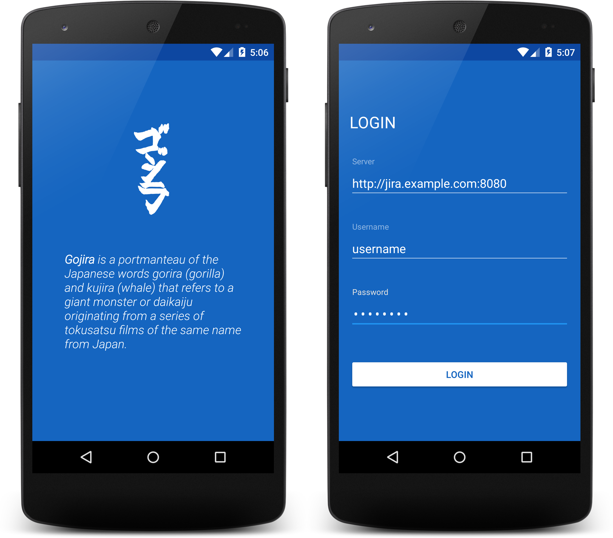

# Gojira for Jira!

Android application for connecting to a [Jira][1] server using the [JIRA REST API][2].

>_Gojira is a portmanteau of the Japanese words gorira (gorilla) and kujira (whale) that refers to a 
giant monster or daikaiju originating from a series of tokusatsu films of the same name from Japan._

_Source: [Wikipedia](https://en.wikipedia.org/wiki/Godzilla#Name)_

## Introduction

Gojira started as an open source project for demonstrating good practices for Android development. 
Since a typical modern Android app needs to communicate with a REST service, Jira was selected as a 
popular issue tracking service that also has a good, fully documented REST API.

## Features

In the current version (`0.1.0`) of the application only a minimal set of features is implemented:

- Splash screen that checks for existing session
- Login screen
- List of Jira projects
- List of Jira dashboards

Design/Programming patterns demonstrated:

- Basic dependency and view injection
- Async http requests with dynamic server
- Basic HTTP authentication
- Secure credentials storage
- Sticky tabs using the new Android Design Support Library

## TODO

A non exhaustive list of next steps for this project:

- Migrate to Dagger 2.0
- Research OAuth for login
- Research secure credential storage
- Implement Issue List
- Implement Issue Detail
- Implement Issue Create/Edit
- Data persistence (Using SQLite, ContentProvider or Realm)

## Contributing

Feel free to contribute code to Gojira. You can do so by forking this repository and sending a pull request. When submitting code, please make every effort to follow existing conventions and style in order to keep the code as readable as possible.

## Open Source Libraries

This application couldn't be realized without some awesome open source libraries. Many thanks to the authors of the following projects:

- [Android-ProgressFragment](https://github.com/johnkil/Android-ProgressFragment)
- [Android-RobotoTextView](https://github.com/johnkil/Android-RobotoTextView)
- [Butter Knife](https://github.com/JakeWharton/butterknife)
- [Dagger](https://github.com/square/dagger)
- [Gson](https://github.com/google/gson)
- [Hawk](https://github.com/orhanobut/hawk)
- [Joda-Time-Android](https://github.com/dlew/joda-time-android)
- [OkHttp](https://github.com/square/okhttp)
- [Picasso](https://github.com/square/picasso)
- [Retrofit](https://github.com/square/retrofit)
- [Timber](https://github.com/JakeWharton/timber)

## License

Copyright 2015 Stratos Theodorou
    
    Licensed under the Apache License, Version 2.0 (the "License");
    you may not use this file except in compliance with the License.
    You may obtain a copy of the License at
    
    http://www.apache.org/licenses/LICENSE-2.0
    
    Unless required by applicable law or agreed to in writing, software
    distributed under the License is distributed on an "AS IS" BASIS,
    WITHOUT WARRANTIES OR CONDITIONS OF ANY KIND, either express or implied.
    See the License for the specific language governing permissions and
    limitations under the License.

[1]: https://www.atlassian.com/software/jira "Jira"
[2]: https://docs.atlassian.com/jira/REST/latest/ "JIRA REST API Reference"
